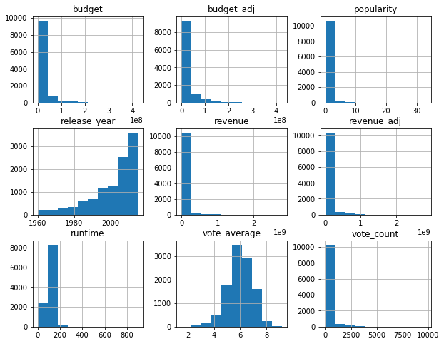
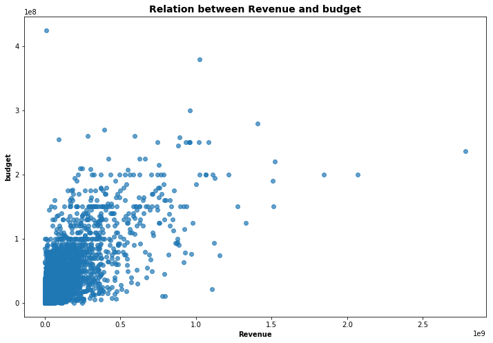
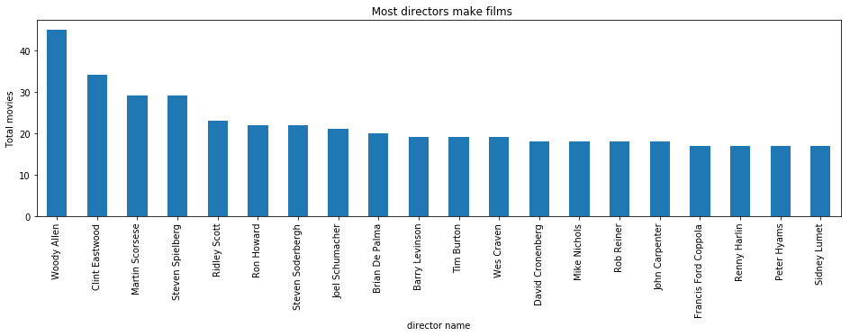
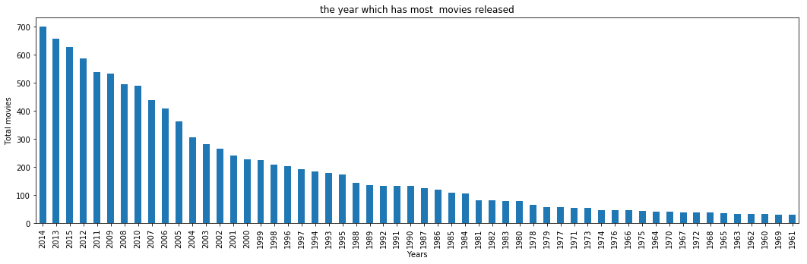
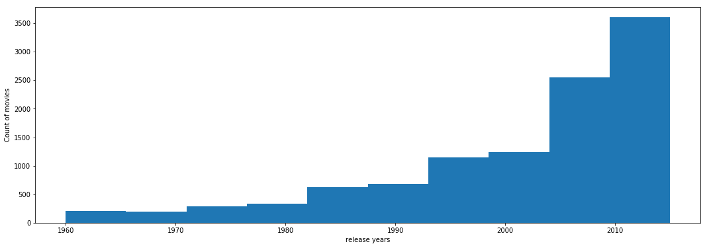
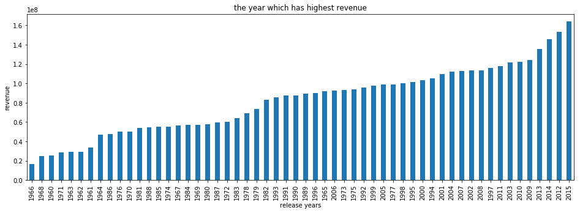
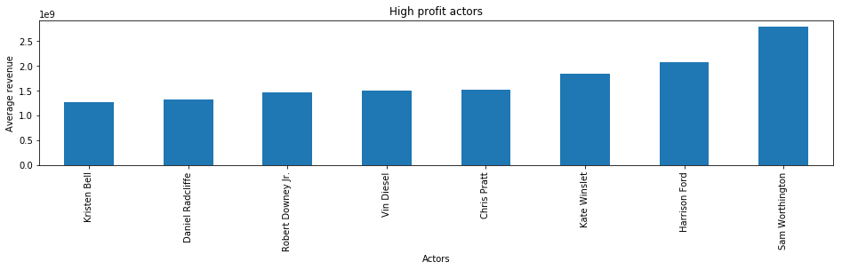
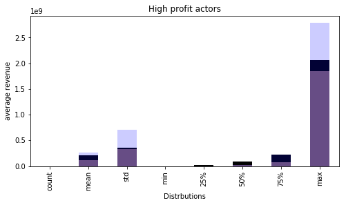
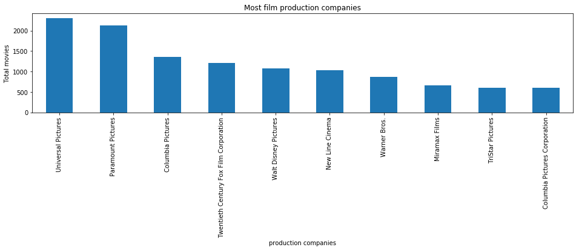

# Project: Investigate a Dataset - [TMDb movie data]

## Table of Contents
<ul>
<li><a href="#intro">Introduction</a></li>
<li><a href="#wrangling">Data Wrangling</a></li>
<li><a href="#eda">Exploratory Data Analysis</a></li>
<li><a href="#conclusions">Conclusions</a></li>
</ul>

<a id='intro'></a>
## Introduction

### Dataset Description 

>This data set contains information about 10,000 movies collected from The Movie Database (TMDb), including user ratings and revenue.


## Questions for Analysis
<ul>
<li><a href="#1">1- Are movies with a high budget make more revenue?</a></li>
<li><a href="#2">2- What is the highest grossing movie?</a></li>
<li><a href="#3">3- Who is the most profitable director?</a></li>
<li><a href="#4">4- Who are the most film-making directors?</a></li>
<li><a href="#5">5- What is the longest movie in terms of duration?</a></li>
<li><a href="#6">6- How many movies are released each year and which period was the most?</a></li>
<li><a href="#7">7- What are the years with the highest returns?</a></li>
<li><a href="#8">8- Who is the most profitable actor ?</a></li>
<li><a href="#9">9- Which company released most movies?</a></li>
</ul>


```python
# set up import statements for all of the packages 
import numpy as np
import pandas as pd
import matplotlib.pyplot as plt
import seaborn as sns
% matplotlib inline
import itertools


```


```python
# Upgrade pandas to use dataframe.explode() function. 
!pip install --upgrade pandas==0.25.0
```

    Requirement already up-to-date: pandas==0.25.0 in /opt/conda/lib/python3.6/site-packages (0.25.0)
    Requirement already satisfied, skipping upgrade: python-dateutil>=2.6.1 in /opt/conda/lib/python3.6/site-packages (from pandas==0.25.0) (2.6.1)
    Requirement already satisfied, skipping upgrade: numpy>=1.13.3 in /opt/conda/lib/python3.6/site-packages (from pandas==0.25.0) (1.19.5)
    Requirement already satisfied, skipping upgrade: pytz>=2017.2 in /opt/conda/lib/python3.6/site-packages (from pandas==0.25.0) (2017.3)
    Requirement already satisfied, skipping upgrade: six>=1.5 in /opt/conda/lib/python3.6/site-packages (from python-dateutil>=2.6.1->pandas==0.25.0) (1.11.0)


<a id='wrangling'></a>
## Data Wrangling


### General Properties


```python
# Loading data 
df = pd.read_csv('tmdb-movies.csv')
```


```python
# print out a few lines
df.head()
```


<div>
<style scoped>
    .dataframe tbody tr th:only-of-type {
        vertical-align: middle;
    }

    .dataframe tbody tr th {
        vertical-align: top;
    }

    .dataframe thead th {
        text-align: right;
    }
</style>
<table border="1" class="dataframe">
  <thead>
    <tr style="text-align: right;">
      <th></th>
      <th>id</th>
      <th>imdb_id</th>
      <th>popularity</th>
      <th>budget</th>
      <th>revenue</th>
      <th>original_title</th>
      <th>cast</th>
      <th>homepage</th>
      <th>director</th>
      <th>tagline</th>
      <th>...</th>
      <th>overview</th>
      <th>runtime</th>
      <th>genres</th>
      <th>production_companies</th>
      <th>release_date</th>
      <th>vote_count</th>
      <th>vote_average</th>
      <th>release_year</th>
      <th>budget_adj</th>
      <th>revenue_adj</th>
    </tr>
  </thead>
  <tbody>
    <tr>
      <th>0</th>
      <td>135397</td>
      <td>tt0369610</td>
      <td>32.985763</td>
      <td>150000000</td>
      <td>1513528810</td>
      <td>Jurassic World</td>
      <td>Chris Pratt|Bryce Dallas Howard|Irrfan Khan|Vi...</td>
      <td>http://www.jurassicworld.com/</td>
      <td>Colin Trevorrow</td>
      <td>The park is open.</td>
      <td>...</td>
      <td>Twenty-two years after the events of Jurassic ...</td>
      <td>124</td>
      <td>Action|Adventure|Science Fiction|Thriller</td>
      <td>Universal Studios|Amblin Entertainment|Legenda...</td>
      <td>6/9/15</td>
      <td>5562</td>
      <td>6.5</td>
      <td>2015</td>
      <td>1.379999e+08</td>
      <td>1.392446e+09</td>
    </tr>
    <tr>
      <th>1</th>
      <td>76341</td>
      <td>tt1392190</td>
      <td>28.419936</td>
      <td>150000000</td>
      <td>378436354</td>
      <td>Mad Max: Fury Road</td>
      <td>Tom Hardy|Charlize Theron|Hugh Keays-Byrne|Nic...</td>
      <td>http://www.madmaxmovie.com/</td>
      <td>George Miller</td>
      <td>What a Lovely Day.</td>
      <td>...</td>
      <td>An apocalyptic story set in the furthest reach...</td>
      <td>120</td>
      <td>Action|Adventure|Science Fiction|Thriller</td>
      <td>Village Roadshow Pictures|Kennedy Miller Produ...</td>
      <td>5/13/15</td>
      <td>6185</td>
      <td>7.1</td>
      <td>2015</td>
      <td>1.379999e+08</td>
      <td>3.481613e+08</td>
    </tr>
    <tr>
      <th>2</th>
      <td>262500</td>
      <td>tt2908446</td>
      <td>13.112507</td>
      <td>110000000</td>
      <td>295238201</td>
      <td>Insurgent</td>
      <td>Shailene Woodley|Theo James|Kate Winslet|Ansel...</td>
      <td>http://www.thedivergentseries.movie/#insurgent</td>
      <td>Robert Schwentke</td>
      <td>One Choice Can Destroy You</td>
      <td>...</td>
      <td>Beatrice Prior must confront her inner demons ...</td>
      <td>119</td>
      <td>Adventure|Science Fiction|Thriller</td>
      <td>Summit Entertainment|Mandeville Films|Red Wago...</td>
      <td>3/18/15</td>
      <td>2480</td>
      <td>6.3</td>
      <td>2015</td>
      <td>1.012000e+08</td>
      <td>2.716190e+08</td>
    </tr>
    <tr>
      <th>3</th>
      <td>140607</td>
      <td>tt2488496</td>
      <td>11.173104</td>
      <td>200000000</td>
      <td>2068178225</td>
      <td>Star Wars: The Force Awakens</td>
      <td>Harrison Ford|Mark Hamill|Carrie Fisher|Adam D...</td>
      <td>http://www.starwars.com/films/star-wars-episod...</td>
      <td>J.J. Abrams</td>
      <td>Every generation has a story.</td>
      <td>...</td>
      <td>Thirty years after defeating the Galactic Empi...</td>
      <td>136</td>
      <td>Action|Adventure|Science Fiction|Fantasy</td>
      <td>Lucasfilm|Truenorth Productions|Bad Robot</td>
      <td>12/15/15</td>
      <td>5292</td>
      <td>7.5</td>
      <td>2015</td>
      <td>1.839999e+08</td>
      <td>1.902723e+09</td>
    </tr>
    <tr>
      <th>4</th>
      <td>168259</td>
      <td>tt2820852</td>
      <td>9.335014</td>
      <td>190000000</td>
      <td>1506249360</td>
      <td>Furious 7</td>
      <td>Vin Diesel|Paul Walker|Jason Statham|Michelle ...</td>
      <td>http://www.furious7.com/</td>
      <td>James Wan</td>
      <td>Vengeance Hits Home</td>
      <td>...</td>
      <td>Deckard Shaw seeks revenge against Dominic Tor...</td>
      <td>137</td>
      <td>Action|Crime|Thriller</td>
      <td>Universal Pictures|Original Film|Media Rights ...</td>
      <td>4/1/15</td>
      <td>2947</td>
      <td>7.3</td>
      <td>2015</td>
      <td>1.747999e+08</td>
      <td>1.385749e+09</td>
    </tr>
  </tbody>
</table>
<p>5 rows × 21 columns</p>
</div>


```python
df.shape
```


    (10866, 21)


```python
# Get rid of columns that we will not use in the analysis process
df.drop(['id', 'imdb_id', 'homepage', 'release_date','tagline'], axis = 1, inplace = True)
df.shape
```


    (10866, 16)


## assessing


```python
# Perform operations to inspect data
df.hist(figsize=(10,8));

```





```python
# types and look for instances of missing or possibly errant data.
df.info()
```

    <class 'pandas.core.frame.DataFrame'>
    RangeIndex: 10866 entries, 0 to 10865
    Data columns (total 16 columns):
    popularity              10866 non-null float64
    budget                  10866 non-null int64
    revenue                 10866 non-null int64
    original_title          10866 non-null object
    cast                    10790 non-null object
    director                10822 non-null object
    keywords                9373 non-null object
    overview                10862 non-null object
    runtime                 10866 non-null int64
    genres                  10843 non-null object
    production_companies    9836 non-null object
    vote_count              10866 non-null int64
    vote_average            10866 non-null float64
    release_year            10866 non-null int64
    budget_adj              10866 non-null float64
    revenue_adj             10866 non-null float64
    dtypes: float64(4), int64(5), object(7)
    memory usage: 1.3+ MB


```python
# Perform general description to inspect data
df.describe()
```


<div>
<style scoped>
    .dataframe tbody tr th:only-of-type {
        vertical-align: middle;
    }

    .dataframe tbody tr th {
        vertical-align: top;
    }

    .dataframe thead th {
        text-align: right;
    }
</style>
<table border="1" class="dataframe">
  <thead>
    <tr style="text-align: right;">
      <th></th>
      <th>popularity</th>
      <th>budget</th>
      <th>revenue</th>
      <th>runtime</th>
      <th>vote_count</th>
      <th>vote_average</th>
      <th>release_year</th>
      <th>budget_adj</th>
      <th>revenue_adj</th>
    </tr>
  </thead>
  <tbody>
    <tr>
      <th>count</th>
      <td>10866.000000</td>
      <td>1.086600e+04</td>
      <td>1.086600e+04</td>
      <td>10866.000000</td>
      <td>10866.000000</td>
      <td>10866.000000</td>
      <td>10866.000000</td>
      <td>1.086600e+04</td>
      <td>1.086600e+04</td>
    </tr>
    <tr>
      <th>mean</th>
      <td>0.646441</td>
      <td>1.462570e+07</td>
      <td>3.982332e+07</td>
      <td>102.070863</td>
      <td>217.389748</td>
      <td>5.974922</td>
      <td>2001.322658</td>
      <td>1.755104e+07</td>
      <td>5.136436e+07</td>
    </tr>
    <tr>
      <th>std</th>
      <td>1.000185</td>
      <td>3.091321e+07</td>
      <td>1.170035e+08</td>
      <td>31.381405</td>
      <td>575.619058</td>
      <td>0.935142</td>
      <td>12.812941</td>
      <td>3.430616e+07</td>
      <td>1.446325e+08</td>
    </tr>
    <tr>
      <th>min</th>
      <td>0.000065</td>
      <td>0.000000e+00</td>
      <td>0.000000e+00</td>
      <td>0.000000</td>
      <td>10.000000</td>
      <td>1.500000</td>
      <td>1960.000000</td>
      <td>0.000000e+00</td>
      <td>0.000000e+00</td>
    </tr>
    <tr>
      <th>25%</th>
      <td>0.207583</td>
      <td>0.000000e+00</td>
      <td>0.000000e+00</td>
      <td>90.000000</td>
      <td>17.000000</td>
      <td>5.400000</td>
      <td>1995.000000</td>
      <td>0.000000e+00</td>
      <td>0.000000e+00</td>
    </tr>
    <tr>
      <th>50%</th>
      <td>0.383856</td>
      <td>0.000000e+00</td>
      <td>0.000000e+00</td>
      <td>99.000000</td>
      <td>38.000000</td>
      <td>6.000000</td>
      <td>2006.000000</td>
      <td>0.000000e+00</td>
      <td>0.000000e+00</td>
    </tr>
    <tr>
      <th>75%</th>
      <td>0.713817</td>
      <td>1.500000e+07</td>
      <td>2.400000e+07</td>
      <td>111.000000</td>
      <td>145.750000</td>
      <td>6.600000</td>
      <td>2011.000000</td>
      <td>2.085325e+07</td>
      <td>3.369710e+07</td>
    </tr>
    <tr>
      <th>max</th>
      <td>32.985763</td>
      <td>4.250000e+08</td>
      <td>2.781506e+09</td>
      <td>900.000000</td>
      <td>9767.000000</td>
      <td>9.200000</td>
      <td>2015.000000</td>
      <td>4.250000e+08</td>
      <td>2.827124e+09</td>
    </tr>
  </tbody>
</table>
</div>


#### Notes that revenue and budget have a zero values 


```python
# display how many rows have zero value
sum(df.revenue == 0) , sum(df.budget == 0)
```


    (6016, 5696)


#### Because of the large size of zero value Decided to not fill or delete to not effect other analysis  and deal with it later

### Data Cleaning


```python
# check if there are any duplication rows
sum(df.duplicated())
```


    1


```python
# check the missing data
df.columns[df.isnull().any()]
```


    Index(['cast', 'director', 'keywords', 'overview', 'genres',
           'production_companies'],
          dtype='object')


```python
# check the missing data
df.isnull().sum()
```


    popularity                 0
    budget                     0
    revenue                    0
    original_title             0
    cast                      76
    director                  44
    keywords                1493
    overview                   4
    runtime                    0
    genres                    23
    production_companies    1030
    vote_count                 0
    vote_average               0
    release_year               0
    budget_adj                 0
    revenue_adj                0
    dtype: int64


```python
# drop duplicated row and Check for drop successfully 
df.drop_duplicates(inplace=True)
df.shape
```


    (10865, 16)


<a id='eda'></a>
## Exploratory Data Analysis

<a id='1'></a>
## Question  1
### Are movies with a high budget make more revenue?


```python
#Creat new data frame for revenue and other related columns
df_budget = df[['budget','revenue','original_title','director','release_year','vote_average']]
df_budget.head()
```


<div>
<style scoped>
    .dataframe tbody tr th:only-of-type {
        vertical-align: middle;
    }

    .dataframe tbody tr th {
        vertical-align: top;
    }

    .dataframe thead th {
        text-align: right;
    }
</style>
<table border="1" class="dataframe">
  <thead>
    <tr style="text-align: right;">
      <th></th>
      <th>budget</th>
      <th>revenue</th>
      <th>original_title</th>
      <th>director</th>
      <th>release_year</th>
      <th>vote_average</th>
    </tr>
  </thead>
  <tbody>
    <tr>
      <th>0</th>
      <td>150000000</td>
      <td>1513528810</td>
      <td>Jurassic World</td>
      <td>Colin Trevorrow</td>
      <td>2015</td>
      <td>6.5</td>
    </tr>
    <tr>
      <th>1</th>
      <td>150000000</td>
      <td>378436354</td>
      <td>Mad Max: Fury Road</td>
      <td>George Miller</td>
      <td>2015</td>
      <td>7.1</td>
    </tr>
    <tr>
      <th>2</th>
      <td>110000000</td>
      <td>295238201</td>
      <td>Insurgent</td>
      <td>Robert Schwentke</td>
      <td>2015</td>
      <td>6.3</td>
    </tr>
    <tr>
      <th>3</th>
      <td>200000000</td>
      <td>2068178225</td>
      <td>Star Wars: The Force Awakens</td>
      <td>J.J. Abrams</td>
      <td>2015</td>
      <td>7.5</td>
    </tr>
    <tr>
      <th>4</th>
      <td>190000000</td>
      <td>1506249360</td>
      <td>Furious 7</td>
      <td>James Wan</td>
      <td>2015</td>
      <td>7.3</td>
    </tr>
  </tbody>
</table>
</div>


```python
df_budget.describe()
```


<div>
<style scoped>
    .dataframe tbody tr th:only-of-type {
        vertical-align: middle;
    }

    .dataframe tbody tr th {
        vertical-align: top;
    }

    .dataframe thead th {
        text-align: right;
    }
</style>
<table border="1" class="dataframe">
  <thead>
    <tr style="text-align: right;">
      <th></th>
      <th>budget</th>
      <th>revenue</th>
      <th>release_year</th>
      <th>vote_average</th>
    </tr>
  </thead>
  <tbody>
    <tr>
      <th>count</th>
      <td>1.086500e+04</td>
      <td>1.086500e+04</td>
      <td>10865.000000</td>
      <td>10865.000000</td>
    </tr>
    <tr>
      <th>mean</th>
      <td>1.462429e+07</td>
      <td>3.982690e+07</td>
      <td>2001.321859</td>
      <td>5.975012</td>
    </tr>
    <tr>
      <th>std</th>
      <td>3.091428e+07</td>
      <td>1.170083e+08</td>
      <td>12.813260</td>
      <td>0.935138</td>
    </tr>
    <tr>
      <th>min</th>
      <td>0.000000e+00</td>
      <td>0.000000e+00</td>
      <td>1960.000000</td>
      <td>1.500000</td>
    </tr>
    <tr>
      <th>25%</th>
      <td>0.000000e+00</td>
      <td>0.000000e+00</td>
      <td>1995.000000</td>
      <td>5.400000</td>
    </tr>
    <tr>
      <th>50%</th>
      <td>0.000000e+00</td>
      <td>0.000000e+00</td>
      <td>2006.000000</td>
      <td>6.000000</td>
    </tr>
    <tr>
      <th>75%</th>
      <td>1.500000e+07</td>
      <td>2.400000e+07</td>
      <td>2011.000000</td>
      <td>6.600000</td>
    </tr>
    <tr>
      <th>max</th>
      <td>4.250000e+08</td>
      <td>2.781506e+09</td>
      <td>2015.000000</td>
      <td>9.200000</td>
    </tr>
  </tbody>
</table>
</div>


```python
# removing zero value data in budget 
df_budget_nonzero= df_budget[df_budget['budget'] != 0]
```


```python
#makeing sure thar theres no zero value any more
sum(df_budget_nonzero.budget == 0) 
```


    0


```python
# creat new dataframe withe no zero value data in revenue 
df_revenue_nonzero= df_budget_nonzero[df_budget_nonzero['revenue'] != 0]
sum(df_budget_nonzero.budget == 0) 
```


    0


```python
plt.figure(figsize = (12, 8)) # size of the figure
scatter_RP = plt.scatter(df_revenue_nonzero['revenue'],
            df_revenue_nonzero['budget'], 
            alpha = 0.7) #transparency level of points on the plot. Used to avoid overplotting
# add and format additional elements, such as titles and axis labels
plt.title("Relation between Revenue and budget", 
          fontsize = 14, 
          weight = "bold")
plt.xlabel("Revenue", weight = "bold")
plt.ylabel("budget", weight = "bold")
plt.show()
```





                  The chart shows that there is a positive correlation between movies budget and revenue
                         that means the high budget movies have more chance to gain high revenue

<a id='2'></a>
## Question  2
### What is the highest grossing movie?


```python
#Use max to get highest revenue value
df_revenue_nonzero.revenue.max()
```


    2781505847


```python
# use the highest revenue value to find which movie title related
most_high_revenue_movie = df_revenue_nonzero.query('revenue == 2781505847 ')['original_title'].to_string(index=False)
print ('Most high revenue movies is  : %s' %most_high_revenue_movie)
```

    Most high revenue movies is  :  Avatar


<a id='3'></a>
## Question 3
### Who is the most profitable director  ?


```python
# use the highest revenue value to find which director name related
most_high_revenue_director=  df_revenue_nonzero.query('revenue == 2781505847 ')['director'].to_string(index=False)
print ('Most high revenue director is : %s' %most_high_revenue_director)
```

    Most high revenue director is :  James Cameron


<a id='4'></a>
## Question 4
### Who are the most film-making directors? 


```python
#Find which of the directors name is the most frequent by using mode
most_making = df['director'].mode().to_string(index=False)
print ('Most directors who have made more films is  : %s' %most_making)
```

    Most directors who have made more films is  :  Woody Allen


```python
# get counts for each director
df_most_directors = df['director'].value_counts() #Who are the directors who have made more films?
df_most_directors.nlargest(20).plot(title='  Most directors make films',kind= 'bar',figsize = (16,4) );
plt.xlabel('director name');
plt.ylabel('Total movies');
```





                 According to the chart , we find that most directors  have made movies are
                     Woody Allen with 45 films then  Clint Eastwood with 34 films

<a id='5'></a>
## Question 5
### What is the longest movie in terms of duration?


```python
# Find the longest movie duration using max
max_duration = df['runtime'].max()

```


```python
#use longest film duration to find title name related
longest_duration = df.query('runtime == {}'.format(max_duration))['original_title'].to_string(index=False) 
print ('The longest movie in terms of duration is :-  %s' %longest_duration)
```

    The longest movie in terms of duration is :-   The Story of Film: An Odyssey


<a id='6'></a>
## Question 6
### How many movies are released each year and which period was the most?


```python
#Create a bar chart for count of movie evert year using the original data frame
df['release_year'].value_counts().plot(title='the year which has most  movies released',kind= 'bar',figsize = (18,5) );# In which year most movies were released?
plt.xlabel('Years');
plt.ylabel('Total movies');
```





                            Here we find most released movies were in 2014,2013 then in 2015


```python
# movies release over time 
df.release_year.plot(kind='hist',figsize = (18,6));
plt.xlabel('release years');
plt.ylabel('Count of movies');
```





    according to the distribution chart the highest period of released movies all over the time was between 2010 and 2015                                                    

<a id='7'></a>
## Question 7
### What are the years with the highest returns?


```python
##Create a bar chart for average revenue for every every year
df_revenue_nonzero.groupby('release_year')['revenue'].mean().sort_values().plot(x = 'release_year', y = 'revenue',title='the year which has highest revenue',kind= 'bar',figsize = (16,5) );
plt.xlabel('release years');
plt.ylabel('revenue');
```





                      The chart shows that the highest revenue was made in 2015 then comes  2012 then 2014 
                             It also shows that the movies industry showed growth all over the time

<a id='8'></a>
## Question 8
### Who is the most profitable actor ?


```python
# creat a function to split as splitter
def splitter (col):
    column_split = df[col].str.split(pat="|", expand=True)
    return column_split
```


```python
#use splitter function to split variable in the cast column
df_actors = splitter('cast')
```


```python
# creat a new dataframe with split variable in the cast column
df_cast = pd.concat([df_revenue_nonzero,df_actors], axis=1)
df_cast.head(2)
```


<div>
<style scoped>
    .dataframe tbody tr th:only-of-type {
        vertical-align: middle;
    }

    .dataframe tbody tr th {
        vertical-align: top;
    }

    .dataframe thead th {
        text-align: right;
    }
</style>
<table border="1" class="dataframe">
  <thead>
    <tr style="text-align: right;">
      <th></th>
      <th>budget</th>
      <th>revenue</th>
      <th>original_title</th>
      <th>director</th>
      <th>release_year</th>
      <th>vote_average</th>
      <th>0</th>
      <th>1</th>
      <th>2</th>
      <th>3</th>
      <th>4</th>
    </tr>
  </thead>
  <tbody>
    <tr>
      <th>0</th>
      <td>150000000.0</td>
      <td>1.513529e+09</td>
      <td>Jurassic World</td>
      <td>Colin Trevorrow</td>
      <td>2015.0</td>
      <td>6.5</td>
      <td>Chris Pratt</td>
      <td>Bryce Dallas Howard</td>
      <td>Irrfan Khan</td>
      <td>Vincent D'Onofrio</td>
      <td>Nick Robinson</td>
    </tr>
    <tr>
      <th>1</th>
      <td>150000000.0</td>
      <td>3.784364e+08</td>
      <td>Mad Max: Fury Road</td>
      <td>George Miller</td>
      <td>2015.0</td>
      <td>7.1</td>
      <td>Tom Hardy</td>
      <td>Charlize Theron</td>
      <td>Hugh Keays-Byrne</td>
      <td>Nicholas Hoult</td>
      <td>Josh Helman</td>
    </tr>
  </tbody>
</table>
</div>


```python
# change colmun name
df_cast.rename(columns = {0:'actor_star',1:'actor_2',2:'actor_3',3:'actor_4',4:'actor_5'}, inplace=True)
df_cast.head(2)
```


<div>
<style scoped>
    .dataframe tbody tr th:only-of-type {
        vertical-align: middle;
    }

    .dataframe tbody tr th {
        vertical-align: top;
    }

    .dataframe thead th {
        text-align: right;
    }
</style>
<table border="1" class="dataframe">
  <thead>
    <tr style="text-align: right;">
      <th></th>
      <th>budget</th>
      <th>revenue</th>
      <th>original_title</th>
      <th>director</th>
      <th>release_year</th>
      <th>vote_average</th>
      <th>actor_star</th>
      <th>actor_2</th>
      <th>actor_3</th>
      <th>actor_4</th>
      <th>actor_5</th>
    </tr>
  </thead>
  <tbody>
    <tr>
      <th>0</th>
      <td>150000000.0</td>
      <td>1.513529e+09</td>
      <td>Jurassic World</td>
      <td>Colin Trevorrow</td>
      <td>2015.0</td>
      <td>6.5</td>
      <td>Chris Pratt</td>
      <td>Bryce Dallas Howard</td>
      <td>Irrfan Khan</td>
      <td>Vincent D'Onofrio</td>
      <td>Nick Robinson</td>
    </tr>
    <tr>
      <th>1</th>
      <td>150000000.0</td>
      <td>3.784364e+08</td>
      <td>Mad Max: Fury Road</td>
      <td>George Miller</td>
      <td>2015.0</td>
      <td>7.1</td>
      <td>Tom Hardy</td>
      <td>Charlize Theron</td>
      <td>Hugh Keays-Byrne</td>
      <td>Nicholas Hoult</td>
      <td>Josh Helman</td>
    </tr>
  </tbody>
</table>
</div>


```python
#use dscribe in revenue clomun to find highest average of revenue
df_revenue_nonzero.revenue.describe()
```


    count    3.854000e+03
    mean     1.076866e+08
    std      1.765393e+08
    min      2.000000e+00
    25%      1.360003e+07
    50%      4.480000e+07
    75%      1.242125e+08
    max      2.781506e+09
    Name: revenue, dtype: float64


```python
# Use the query to determine 75% of revenue and more 
mask =df_cast.query('revenue>=1242125000')
```


```python
# Use groupby to get the name of the actor associated with high average revenue
mask.groupby('actor_star')['revenue'].mean().sort_values().plot(title='High profit actors',kind= 'bar',figsize = (16,3))
plt.xlabel('Actors');
plt.ylabel('Average revenue');
```





### according to the chart we found that  'Sam Worthington' is the most profitable actor but after a little search we will find that  Harrison Ford and Kate Winslet are the highest-grossing actors and 'Sam Worthington' is not included  and that for several reasons for example : 
#### 1- because of revenue zero values in data 
#### 2- Sam Worthington's avatar movie which has the highest revenue with a big difference comparing other movies

  ### so we look for  Harrison Ford and Kate Winslet statistics 
  #### checking  reason 1


```python
#creat dataframe by Harrison Ford as actor
Ford = df[df['cast'].str.contains("Harrison Ford", na = False)]
```


```python
# Show general stats
Ford.revenue.describe()
```


    count    4.200000e+01
    mean     2.124486e+08
    std      3.587855e+08
    min      0.000000e+00
    25%      1.451066e+07
    50%      8.891011e+07
    75%      2.199493e+08
    max      2.068178e+09
    Name: revenue, dtype: float64


```python
# Check the number of movies by Harrison Ford at zero revenue value
Ford.query('revenue ==0').shape
```


    (6, 16)


```python
#creat dataframe by  Kate Winslet as actor
Kate= df[df['cast'].str.contains('Kate Winslet', na = False)]
```


```python
# Show general stats
Kate.revenue.describe()
```


    count    3.100000e+01
    mean     1.096964e+08
    std      3.321256e+08
    min      0.000000e+00
    25%      0.000000e+00
    50%      1.570501e+07
    75%      7.374191e+07
    max      1.845034e+09
    Name: revenue, dtype: float64


```python
# Check the number of movies by Kate Winslet at zero revenue value
Kate.query('revenue ==0').shape
```


    (10, 16)


```python
#creat dataframe by Robert Sam Worthington as actor
Sam=df[df['cast'].str.contains('Sam Worthington', na = False)]

```


```python
# Show general stats
Sam.revenue.describe()
```


    count    1.500000e+01
    mean     2.671979e+08
    std      7.068280e+08
    min      0.000000e+00
    25%      0.000000e+00
    50%      1.750852e+07
    75%      2.180704e+08
    max      2.781506e+09
    Name: revenue, dtype: float64


```python
#Check the number of movies by Sam Worthington at zero revenue value
Sam.query('revenue ==0').shape
```


    (5, 16)


#### movies with zero value for Scarlett Johansson and Sam Worthington are almost equal and for  Robert Downey more with 5  movies
#### so it's not about zero value

### so will check  about Avatar movie  if  it the reason as outlier
#### checking reason 2


```python
Ford.revenue.describe().plot(title='High profit actors',color='black',alpha =0.99,kind= 'bar',figsize = (8,4)),
Kate.revenue.describe().plot(title='High profit actors',color='pink',alpha =0.5,kind= 'bar',figsize = (8,4)),
Sam.revenue.describe().plot(title='High profit actors',color='blue',alpha =0.2,kind= 'bar',figsize = (8,4));
plt.xlabel('Distrbutions');
plt.ylabel('average revenue');
```





  Noted here that just the maximum value and standard deviation value for Sam Worthington are much high

            which may be affected by the highest revenue movie ' Avatar'


```python
# as mentioned before 'avatar' has a highest revenue before
# get max value for Sam Worthington
avatar_value = Sam.revenue.max()
avatar_value
```


    2781505847


```python
#Find total revenue without avatar revenue by subtracting its value
Sam_without_avatar =  Sam.revenue.sum() - avatar_value

```


```python
#check the difference between Scarlett Johansson's total revenue and Sam Worthington's revenue without avatar
Sam_without_avatar >= Ford.revenue.sum()
```


    False


```python
#check the difference between Kate Winslet's revenue and Sam Worthington's revenue without avatar
Sam_without_avatar >= Kate.revenue.sum()
```


    False


### here we find that  Avata's was the  resone to show 'Sam Worthington' as a hight brofitable actor

<a id='9'></a>
## Question 9
### Which company released most movies?


```python
#use splitter function to split variable in the production_companies column 
df_production_companies = splitter('production_companies')
```


```python
# conect dataframe with split variable in the production_companies column with no zero value data
df_production_companies = pd.concat([df_revenue_nonzero,df_production_companies], axis=1)
df_production_companies.head()
```


<div>
<style scoped>
    .dataframe tbody tr th:only-of-type {
        vertical-align: middle;
    }

    .dataframe tbody tr th {
        vertical-align: top;
    }

    .dataframe thead th {
        text-align: right;
    }
</style>
<table border="1" class="dataframe">
  <thead>
    <tr style="text-align: right;">
      <th></th>
      <th>budget</th>
      <th>revenue</th>
      <th>original_title</th>
      <th>director</th>
      <th>release_year</th>
      <th>vote_average</th>
      <th>0</th>
      <th>1</th>
      <th>2</th>
      <th>3</th>
      <th>4</th>
    </tr>
  </thead>
  <tbody>
    <tr>
      <th>0</th>
      <td>150000000.0</td>
      <td>1.513529e+09</td>
      <td>Jurassic World</td>
      <td>Colin Trevorrow</td>
      <td>2015.0</td>
      <td>6.5</td>
      <td>Universal Studios</td>
      <td>Amblin Entertainment</td>
      <td>Legendary Pictures</td>
      <td>Fuji Television Network</td>
      <td>Dentsu</td>
    </tr>
    <tr>
      <th>1</th>
      <td>150000000.0</td>
      <td>3.784364e+08</td>
      <td>Mad Max: Fury Road</td>
      <td>George Miller</td>
      <td>2015.0</td>
      <td>7.1</td>
      <td>Village Roadshow Pictures</td>
      <td>Kennedy Miller Productions</td>
      <td>None</td>
      <td>None</td>
      <td>None</td>
    </tr>
    <tr>
      <th>2</th>
      <td>110000000.0</td>
      <td>2.952382e+08</td>
      <td>Insurgent</td>
      <td>Robert Schwentke</td>
      <td>2015.0</td>
      <td>6.3</td>
      <td>Summit Entertainment</td>
      <td>Mandeville Films</td>
      <td>Red Wagon Entertainment</td>
      <td>NeoReel</td>
      <td>None</td>
    </tr>
    <tr>
      <th>3</th>
      <td>200000000.0</td>
      <td>2.068178e+09</td>
      <td>Star Wars: The Force Awakens</td>
      <td>J.J. Abrams</td>
      <td>2015.0</td>
      <td>7.5</td>
      <td>Lucasfilm</td>
      <td>Truenorth Productions</td>
      <td>Bad Robot</td>
      <td>None</td>
      <td>None</td>
    </tr>
    <tr>
      <th>4</th>
      <td>190000000.0</td>
      <td>1.506249e+09</td>
      <td>Furious 7</td>
      <td>James Wan</td>
      <td>2015.0</td>
      <td>7.3</td>
      <td>Universal Pictures</td>
      <td>Original Film</td>
      <td>Media Rights Capital</td>
      <td>Dentsu</td>
      <td>One Race Films</td>
    </tr>
  </tbody>
</table>
</div>


```python
 #creat a function to get count of each production company
def counter (col):
    company_count = df_production_companies[0].value_counts().dropna()
    return company_count
```


```python
# Find count of each production company in all the divided columns by counter function
(counter(0)+ counter(1)+ counter(2)+ counter(3)+ counter(4)).nlargest(10).plot(title='Most film production companies',kind= 'bar',figsize = (16,3));
plt.xlabel('production companies');
plt.ylabel('Total movies');
```





                              companie released most movies is Universal Pictures with 2300 movie 
                        then comes Paramount Pictures with 2130 movie then Columbia Picture with 1355 movie

<a id='conclusions'></a>
## Conclusions


## 1- Are movies with a high budget make more revenue?
### -We found that there is a positive correlation between so high budget movies, having more chance to gain higher revenue than low-budget movies

## 2- What is the highest grossing movie?
### -Most high revenue movies is    Avatar


## 3- Who is the most profitable director?
### -Most high revenue director is   'James Cameron'


## 4- Who are the most film-making directors?
### -Most directors who have made more films is   'Woody Allen'


## 5- What is the longest movie in terms of duration?
### -The longest movie in terms of duration is :-   The Story of Film: An Odyssey


## How many movies are released each year and which period was the most?
### most released movies period was from 2010 to 2015 by 
### 2014 -   700 movies
### 2013 -   659 movies
### 2015 -   629 movies
### 2012 -   588 movies
### 2011 -   540 movies

## 7- What are the years with the highest returns?
###  Year's Highest revenue are 2015 then 2012 then 2014 then 2013


## 9- Which companies released most movies?


### the companies released most movies are  :
### Universal Pictures       with                2300 movie
###                                                                          Paramount Pictures     2130 movie
###                                                                          Columbia Picture    with       1355 movie


## Data Limitations 

the data provided by the dataset is sufficient to draw good conclusions but I  noticed several problems that may affect judgment and  exploring data for example :
- the are many 'non' values in the dataset which have a high effect

- most of the remaining data are 0-valued and treated as missing values and after cleaning is pretty insufficient.

## Recommendations

 so  we recommend doing scrapping and research  for a different source for better data quality 

## Conclusive

1. a movie budget has a high effect on movie success.
2. The film industry has become the most attractive industry for investors and it has been constantly growing over the past years


```python
from subprocess import call
call(['python', '-m', 'nbconvert', 'Investigate_a_Dataset.ipynb'])
```


    0


